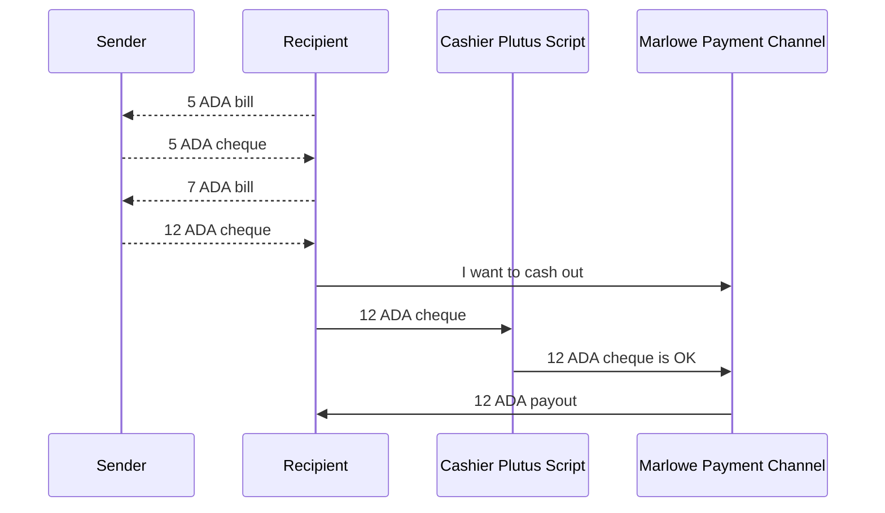
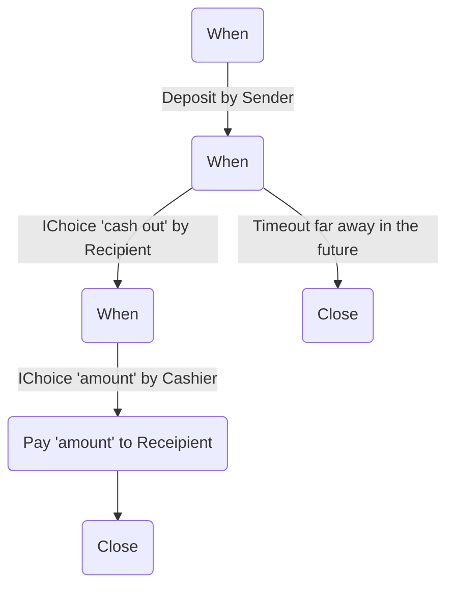
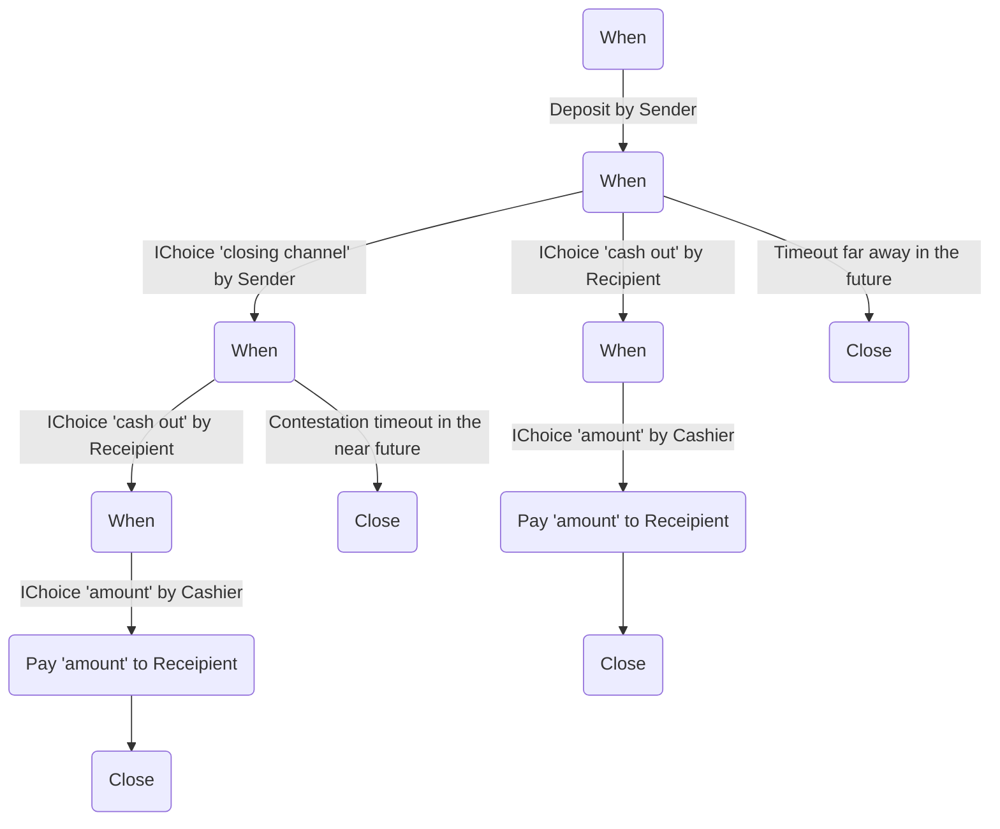

## Abstract

This document describes a simple protocol which introduces a delegetion scheme of the `Input`s from a role to another independent party. The party gains a priviledge to perform a particular step or set of steps in the contract on behalf of the delegator. The scheme is minimal by design so the acompanying Plutus script is tiny and easy to audit.
We don't limit the `Input` type to an `IChoice` because this scheme allows us to sign chain of `Input`s even though some of them could be performed by other party. In many cases the `IChoice` itself will be the commitment but it could come with a bundle of "conditions".

The protocol does not provide execution guarantees on its own - those should be implemented using different Marlowe patterns on the contract level. I will provide an illustrative example.

## Motivation

Delegating an execution of an action to another party may seem not particularly useful at a first glance. But if we look at it as an irreversible commitment from the delegator side and if we also add the transparent and deterministic nature of Marlowe to the picture we can start seeing a possibility for more powerful protocols which can be built on top of that.

As a motivating example I would like to introduce a draft of unidirectional payment channel implementation with entirely offchain payment process till the final cash out. The channel will be fully secure and not bounded by the number of atomic transfers but by the limit of the funds locked in it. In other words we will be able to compress many off-chain subpayments into a single on-chain one.



So in the scheme above the dashed arrows (`-->`) represent off-chain communication. Please note that after the second bill `Sender` just issues a new cheque which covers both expenses. Because there will be only a single payout opportunity the highest one will be used and the smaller ones will be discarded.

The solid arrows are parts of the final cash out transaction. They are rather conceptual and they don't directly represent element of the final contract which is sketched below:




In the contract above the action performed by `Cashier` commitment from the `Sender` side. So `IChoice "amount"` is the cheque which `Sender` and `Recipient` exchange off-chain. This is a signed `Input` which is used at the end to cash out the money on the L1 layer.

We can use two different keys for `Sender` wallet and `Sender` commitments so the application which will issue the cheques doesn't even have to be the wallet itself.
The same separation strategy could be used for the `Recipient` payout initiation and the wallet if we cover the tx fees from the channel itself.

The "cash out" branch is guarded by `Recipient` action so the cheques are safe and cannot be used by `Sender` to initiate the payout process with outdated cheque. The cheques themselves can be stored even publically or send to multiple storage backends for redundancy (email, IPFs etc.).

We can also imagine a simple modification which introduces channel closure - we add a "closing channel" branch which allows the `Sender` to initiate the closing procedure which contains a shorter contestation period during which `Recipient` still have a chance to withdraw



## Specification

### Version

This change comprises the Plutus validators which implements `Inputs Commitment` validator.

### Validator inputs and state

#### State

Validator which will perform checks over commitment requires a minimal state:

```Haskell
type ThreadToken = (TokenName, CurrencySymbol)
newtype Datum = Datum ThreadToken PubKey
```

* The first element of the datum is information about the `thread token` in corresponding Marlowe contract. The name and the currency which should uniquely identify Marlowe execution path.

    We don't want to assume equality between currency symbol and thread token policy because this assumption can be broken by possible future changes in the Marlowe Validator protocol.

* Datum should also contain public key of the signatory who will sign the commitments.

* On the UTxO value level we expect only role token and min ADA so we can extract the currency symbol and role name easily.

#### Redeemer

The redeemer to the script alows us to perform two actions - guard input applications with commitments and release of the token.

```Haskell
type ShouldBurnToken = Bool
data Redeemer
    = Redeemer ([Input], Maybe TimeInterval, ThreadToken) Signature ShouldBurnToken
    | DoBurnToken
```

#### Verification

##### Commitment Checking

* First check own redeemer.

* If the redeemer contains commitment check the `Signature` value. It should be valid signature for the `PubKey` key and payload `([Input], Maybe TimeInterval, ThreadToken)` (we can use `BuiltinData` of this `tuple` as baseline).

* Check if the `ThreadToken` from the `Redeemer` matches the `ThreadToken` from the datum. The commitment should be dedicated to the particular Marlowe contract.

* Find and pick the input with the thread token.
    
    > This check can be costly so we can consider optimization which introduces `TxIn` index to the redeemer to speed up search and avoid `Value`` decoding.

* For the above input decode the `Redeemer` which should be a Marlowe `TransactionInput`.

* Verify that the list of `[Inputs]` from the `TransactionInput` contains subsequence of `Input`s from own redeemer. In other words we want to check if the commited input series is actually executed in the transaction.

    > This check could be optimize by a hint provided in the `Redeemer` which could indicate the initial position of the subsequence.

* Verify that a `Party` in all the other inputs from the `TransactionInput` is different than the role which is locked in the own UTxO.

* Validate equality of the time interval from own datum if present against the time interval from the Marlowe `Redeemer`.

##### Token Burning or Thread Preservation

* If the action is `DoBurnToken` or `ShouldBurnToken` is `True` we expect role token to be burned (we can do this by checking the minting value in the `ScriptContext`).

* If we don't burn the token we expect that the own input should be present in the output set with exactly the same value and the same datum.


## Rationale

> The rationale fleshes out the specification by describing what motivated the design and why particular design decisions were made. It should describe alternate designs that were considered and related work. The rationale should provide evidence of consensus within the community and discuss important objections or concerns raised during discussion.|

## Backwards compatibility

> | All MIPs that introduce backwards incompatibilities must include a section describing these incompatibilities and their severity. The MIP must explain how the author proposes to deal with these incompatibilities.|

## Path to Active

> | Path to Active | A reference implementation, observable metrics or anything showing the acceptance of the proposal in the community. It must be completed before any MIP is given status "Active", but it need not be completed before the MIP is accepted. It is better to finish the specification and rationale first and reach consensus on it before writing any code. |

## Copyright

This MIP is licensed under [CC-BY-4.0](https://creativecommons.org/licenses/by/4.0/legalcode).
