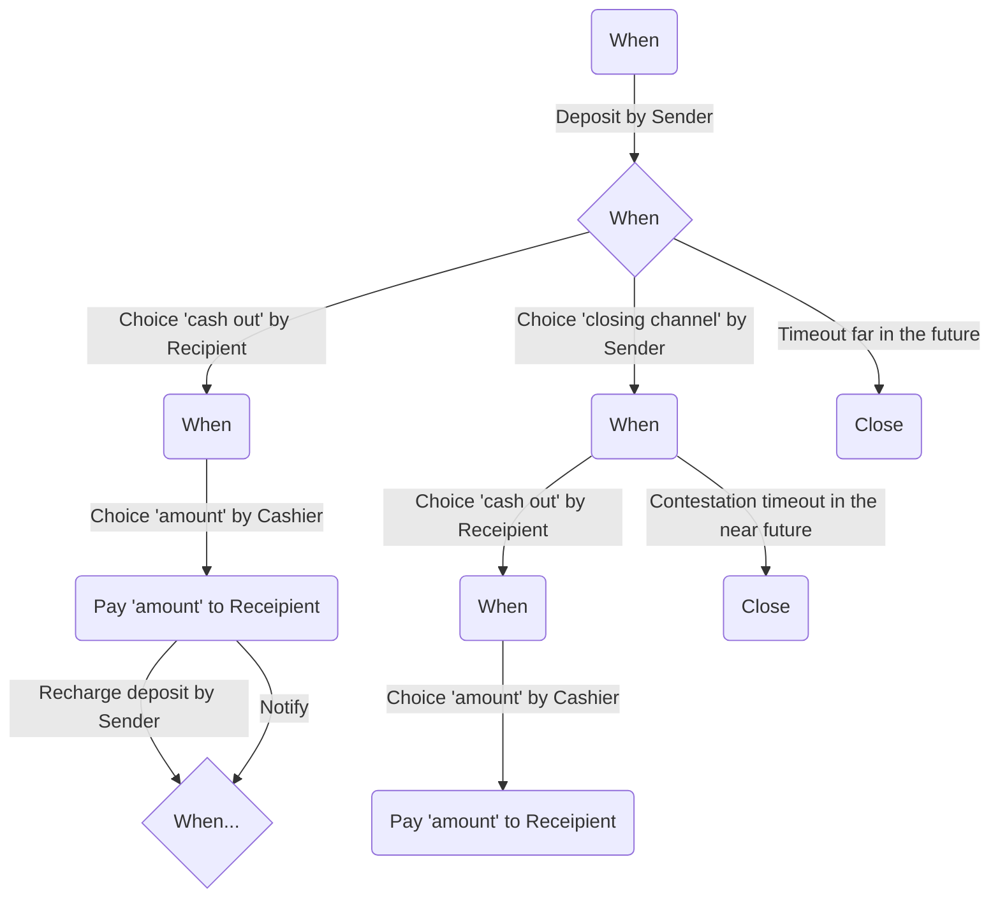

## Abstract

This document describes a simple protocol which introduces a delegetion scheme of the `Input` from a role to another independent party. The party gains a priviledge to perform a particular step or set of steps in the contract on behalf of the delegator. The scheme is minimal by design so the acompanying Plutus script is tiny and easy to audit.
We don't limit the `Input` type to an `IChoice` but in seems to be rather natural step in a contract which  `Choice` limitation with unique `ChoiceId` would be rather desired.

The protocol does not provide execution guarantees on its own - those should be implemented using different Marlowe patterns on the contract level. I will provide an illustrative example.

## Motivation

Delegating an execution of an action to another party may seem not particularly useful at a first glance. But if we look at it as an irreversible commitment from the delegator side and if we also add the transparent and deterministic nature of Marlowe to the picture we can start seeing a possibility for more powerful protocols which can be built on top of that.

As a motivating example I would like to introduce a draft of unidirectional payment channel implementation with entirely offchain payment process till the final cash out. The channel will be fully secure and not bounded by the number of atomic transfers but by the limit of the funds locked in it. In other words we will be able to compress many subpayments into a single one.

## Specification

### Version

This change comprises the Plutus validators which implements input commitment.

## Rationale

> The rationale fleshes out the specification by describing what motivated the design and why particular design decisions were made. It should describe alternate designs that were considered and related work. The rationale should provide evidence of consensus within the community and discuss important objections or concerns raised during discussion.|

## Backwards compatibility

> | All MIPs that introduce backwards incompatibilities must include a section describing these incompatibilities and their severity. The MIP must explain how the author proposes to deal with these incompatibilities.|

## Path to Active

> | Path to Active | A reference implementation, observable metrics or anything showing the acceptance of the proposal in the community. It must be completed before any MIP is given status "Active", but it need not be completed before the MIP is accepted. It is better to finish the specification and rationale first and reach consensus on it before writing any code. |

## Copyright

This MIP is licensed under [CC-BY-4.0](https://creativecommons.org/licenses/by/4.0/legalcode).
